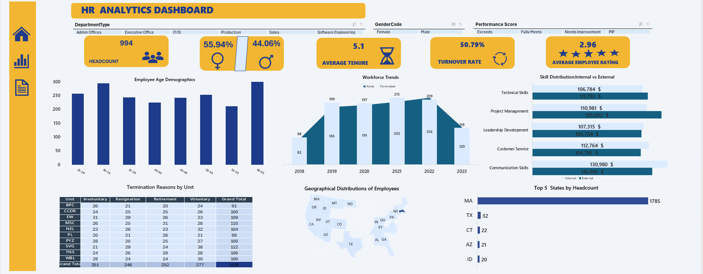

# HR Analytics & Workforce Retention Dashboard

## Overview
This project is an interactive HR analytics dashboard built in Microsoft Excel to examine employee retention, turnover dynamics, and workforce demographics. The objective was to clean raw operational HR data and structure it into an executive summary view.

## Workbook Architecture
The file is structured into four functional worksheets:
* **Raw Data:** Unaltered source data containing employee records, hire/termination dates, and compensation details.
* **Cleaned Data:** Structured Excel table with standardized dates, consistent naming, and validated categories.
* **PIVOT:** Dedicated calculation engine containing Pivot Tables for age brackets, unit terminations, and slicer caching.
* **DASHBOARD:** Single-page user interface featuring interactive KPI cards, charts, and filter controls.

## Key Metrics Analyzed
* **Active Headcount:** 994 active employees.
* **Gender Ratio:** 55.94% Female / 44.06% Male.
* **Average Tenure:** 5.1 years.
* **Turnover Rate:** 50.79% overall attrition.
* **Average Rating:** 2.96 / 5.00 employee evaluation score.

## Visualizations & Insights
* **Demographics:** Age distribution histogram across groups from 20 to 60+.
* **Turnover Cohorts:** Combo chart (Area & Column) comparing active headcount vs. exits between 2018 and 2023.
* **Termination Breakdown:** Unit-level matrix analyzing voluntary, involuntary, resignation, and retirement exits.
* **Geographic Distribution:** Map chart and Top 5 state ranking (MA, TX, CT, AZ, ID).
* **Training Costs:** Skill development expense breakdown across functional departments.

## Technical Details
* Multi-criteria filtering using interconnected Excel Slicers (Department, Gender, Performance).
* Dynamic KPI references built with =IFERROR(VLOOKUP(...)) to prevent `#N/A` breaks when filters are cleared or changed.
* Custom UI layout with removed gridlines, integrated icons, and fixed dashboard boundaries.

